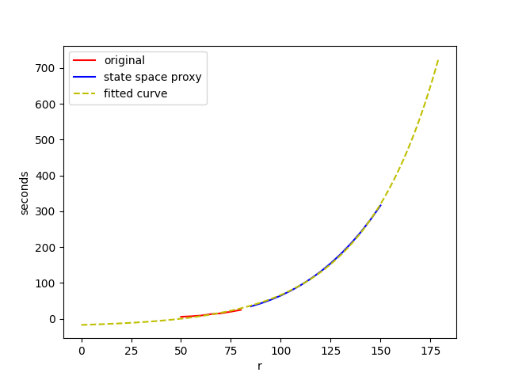
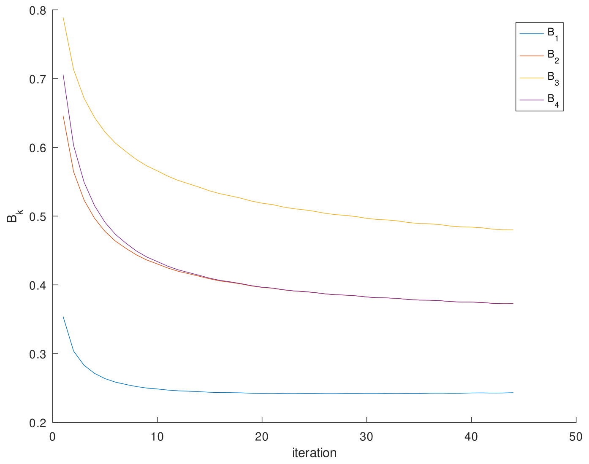

## Complexity Estimation

### Requirements

Lattice point counting and enumeration is done by [polymake](https://polymake.org/), which is available as package for many Linux distributions.
When using Poetry, use `poetry install` and `poetry run python script.py` to execute the scripts.

### Scripts

- Both polymake scripts `point.pl` and `count.pl` (Perl) script contain the same description of the state space polyhedron using a set of linear inequalities.
- Use `compute_runtimes.py` to measure actual runtimes for capacities `C=(r,r,r,r)`.
The script calls the `points.pl` polymake script to get a list of lattice points (stored in `out.json`), which are used to compute the normalization constant `G`.
- The `compute_points.py` script calls the `count.pl` polymake script that computes cardinality of the state space for various larger values of `r`. This probably could have been managed by one Perl script, but I am not really familiar with this language.
- Both script store their results in Python pickle files `runtime_result.p` and `points_result.p`, which are read by `estimate_plot.py` to produce the final figure.

## Erlang Fixed-Point Approximation

Because directly calculating the blocking probabilities scales at least linearly with the size of the state space, this becomes infeasible even for very small C quickly.
Therefore, the Erlang fixed-point approximation scheme can provide fast approximations of the stationary blocking probabilities.
Note that the code is specifically tailored to K=4 customer classes and L=4 links. Changing rho and C should be fine (as long as `rho <= C`).

